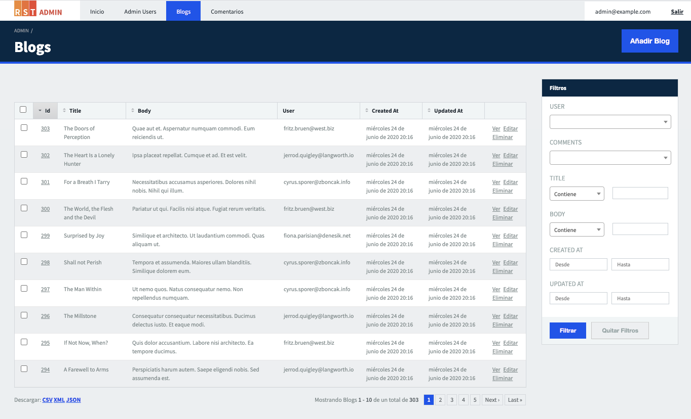
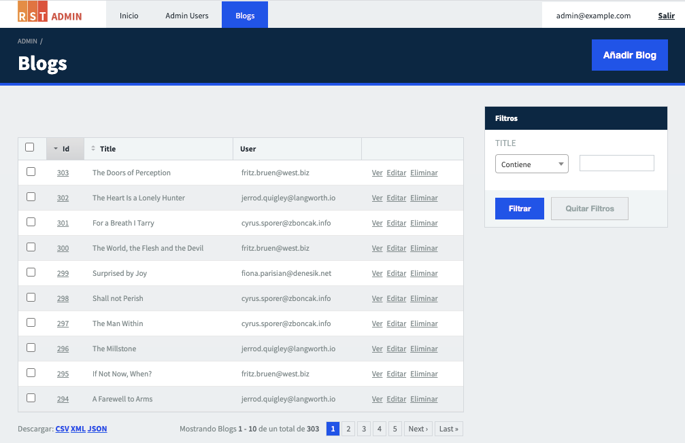
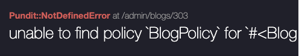
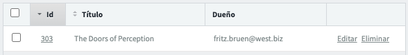
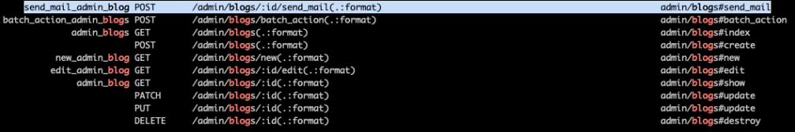
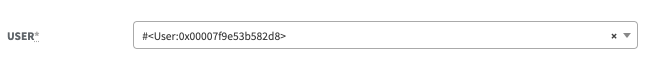
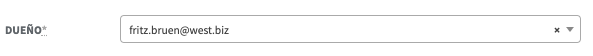
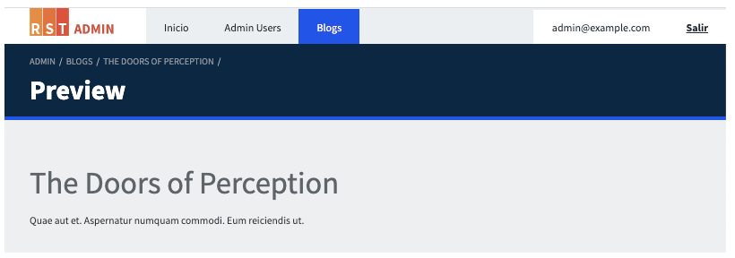

# Active Admin

Es una gema que utilizamos como back office.

## ¿Por qué la usamos?

La utilizamos porque resuelve rápidamente los típicos CRUD de admin. Con ActiveAdmin en unos minutos puedes tener para un recurso (modelo ActiveRecord): el menu para acceder, las vistas para crear/editar, el listado paginado con filtros y varias cosas más.

## ¿Cómo la usamos?

### Instalación

La gema viene instalada si el proyecto se generó usando [Potassium](https://github.com/platanus/potassium). Si no es así, igual puedes agregarlo luego ejecutando `potassium install admin`.

### Uso básico

Supongamos que tenemos el modelo `Blog` con los atributos `title`, `body` y `user` (owner del Blog). Si agregamos bajo `/app/admin/blogs.rb` el siguiente código:

```ruby
ActiveAdmin.register Blog do
end
```

Al acceder a `http://localhost:3000/admin/blogs` veremos el listado de blogs:



y si hacemos clic en el link "Editar" de alguno de los blogs veremos el formulario:


Listo! Eso es todo lo que necesitas hacer para tener algo funcionando. De todos modos, en un proyecto Platanus comúnmente verás algo como esto:

```ruby
ActiveAdmin.register Blog do
  permit_params :title, :body, :user_id

  filter :title

  index do
    selectable_column
    id_column
    column :title
    column :user
    actions
  end

  show do
    attributes_table do
      row :title
      row :body
      row :user
    end
  end

  form do |f|
    f.semantic_errors

    f.inputs do
      f.input :title
      f.input :body
      f.input :user
    end

    f.actions
  end
end
```

para tener más control de lo que se quiere mostrar. Por ejemplo, así se ve el index con la configuración custom:



### I18n

Active Admin toma la configuración de locales de Rails para traducir los nombres de las columnas.
Por ejemplo, para traducir los atributos de `Blog` deberías tener la siguiente configuración:

`/config/locales/es-CL.yml`

```yaml
es-CL:
  activerecord:
    attributes:
      blog:
        title: Título
        body: Texto
        user: Dueño
```

De esta manera al entrar por ejemplo la vista de un `Blog` verás los atributos traducidos:


Ten en cuenta que también funciona con métodos (getters) custom. Por ejemplo, podrías tener:

`/app/models/blog.rb`

```ruby
class Blog < ApplicationRecord
  def my_method
    "Hola!"
  end
end
```

`/config/locales/es-CL.yml`

```yaml
es-CL:
  activerecord:
    attributes:
      blog:
        my_method: Mi método
```

`/app/admin/blogs.rb`

```ruby
ActiveAdmin.register Blog do
  index do
    selectable_column
    id_column
    column :my_method
    actions
  end

  show do
    attributes_table do
      row :my_method
    end
  end
end
```

y funcionará.

### Menú

**Agrupar recursos**

Para agrupar varios items dentro de un mismo menú, debes:

1. Definir el menú en el initializer de active admin:

    `/config/initializers/active_admin.rb`

    ```ruby
    ActiveAdmin.setup do |config|
      config.namespace :admin do |admin|
        admin.build_menu do |menu|
          menu.add id: :some_menu_id, label: "Grupo"
        end
      end
    end
    ```

1. Definir en el recurso su menú padre:

    `/app/admin/blogs.rb`

    ```plain text
    ActiveAdmin.register Blog do
      menu parent: :some_menu_id
    end
    ```

    

**Ocultar menú**

Se hace de la siguiente manera:

`/app/admin/blogs.rb`

```ruby
ActiveAdmin.register Blog do
  menu false
end
```

A simple vista parece no tener mucha utilidad pero lo importante aquí es que aunque no exista el menú, igual existen los endpoints. Algo que puede ser conveniente si queremos usar alguna ruta del admin como una API.


**Menú condicional**

Puede ser útil mostrar u ocultar un menú dependiendo de una condición. El caso más típico es el de roles. Por ejemplo:

`/app/admin/blogs.rb`

```ruby
ActiveAdmin.register Blog do
  menu if: -> { current_admin_user.super_admin? }
end
```

### Permisos (Pundit)

En Platanus usamos Active Admin con el [adapter de Pundit](https://activeadmin.info/13-authorization-adapter.html#using-the-pundit-adapter) para autorizar recursos.
Si al registrar un nuevo recurso en AA, no tienes creado el policy de ese recurso, observarás un error así:



Si esto ocurre, agrega el policy correspondiente y define los permisos para cada una de las acciones del CRUD:

```ruby
class BlogPolicy < ApplicationPolicy
  def index?
    true
  end

  def show?
    true
  end

  def create?
    true
  end

  def new?
    create?
  end

  def update?
    true
  end

  def edit?
    update?
  end

  def destroy?
    true
  end
end
```

> Si todavía no estás en la instancia del proyecto en la cual tienes que preocuparte por permisos deja todas las acciones en true.

Es importante mencionar que si una acción no tiene permisos, esta desaparecerá del menú y links, etc. Por ejemplo:

```ruby
class BlogPolicy < ApplicationPolicy
  def show?
    false
  end
end
```

Al tratar de acceder a `http://localhost:3000/admin/blogs/303`


Se puede ver además como el link a "Ver" desapareció:



### Action Items

Los `action_item`s son botones que se pueden agregar a las vistas del recurso. Por ejemplo, el siguiente código mostrará un botón (link), solo en la vista `index`, para ir al listado de administradores.

```ruby
action_item :go_to_admins, only: [:index] do
  link_to("Ver Administradores", admin_admin_users_path)
end
```


> Ten en cuenta que puedes decidir en qué vistas aparecerá el botón usando la opción only.

### Member Action

Las `member_action`s son acciones extra que se pueden agregar al controller del recurso. Por ejemplo, el siguiente código:

```ruby
member_action :send_mail, method: :post do
  # Ejecuta algún código. Por ejemplo enviar el blog por mail a n usuarios.

  redirect_to admin_blogs_path
end
```

sumará el endpoint `/admin/blogs/:id/send_mail` a los endpoints del CRUD.



Ten en cuenta que se puede utilizar `action_item`s para ejecutar estas nuevas acciones. Por ejemplo, el siguiente código agregará un botón en la vista del blog (`show`) desde el que se llamará a la acción `send_mail`.

```ruby
action_item :send_mail, only: [:show] do
  link_to("Enviar a Admin Users", send_mail_admin_blog_path(resource), method: :post)
end
```

Una alternativa a los `action_item`s es agregar la acción al listado del index así:

```ruby
index do
  # ...
  actions do |blog|
    link_to("Enviar", send_mail_admin_blog_path(blog), method: :post)
  end
end
```


### Collection Action

Es lo mismo que una `member_action` pero sin apuntar a un recurso en particular sino a la colección. Por ejemplo, la siguiente `member_action`:

```ruby
member_action :send_mail, method: :post do
  # ...
end
```

creará el siguiente endpoint: `POST /admin/blogs/:id/send_mail`. En cambio, esta `collection_action`:

```ruby
collection_action :send_mails, method: :post do
  # ...
end
```

generará este: `POST /admin/blogs/send_mails`

La idea entonces con esto es que las `member_action`s se usen junto a `action_item`s en `show`, `new` y `update` y las `collection_action` con `action_item`s en el `index`.

> Ten en cuenta que dentro de una member_action podrás acceder al recurso actual (en nuestro ejemplo un Blog de id x) usando el método resource. En cambio, en una collection_action, podrás acceder al listado de recursos (lista de Blogs en el ejemplo), que está mostrando el index en ese momento, usando el método collection.

### Display Name

Si prestaste atención a la imagen del formulario de la sección "Uso básico", seguro notaste que el selector de usuarios no muestra correctamente el nombre de los mismos:



esto se debe a que Active Admin espera que los recursos tengan definido el método: `:display_name` para que puedan ser representados como "String". Si el recurso no lo implementa, simplemente llamará a `to_s` mostrando como resultado lo que vemos en el selector. Entonces, para solucionar esto, podemos hacer lo siguiente:

```ruby
class User < ApplicationRecord
  def display_name
    email
  end
end
```



> Ten en cuenta que display_name (o cualquiera de las otras opciones) se utilizará en varios lugares: en el título de un recurso, en los links de las rows/columns y, como vimos, en los selectores.

### Vistas custom

Hay veces que necesitamos agregar nuevos endpoints con HTML a medida. Para hacer esto hacer lo siguiente:

1. Agregar la `member_action`:

    ```plain text
    member_action :preview, method: :get do
      @blog = resource
    end
    ```

1. Agregar el `action_item`:

    ```plain text
    action_item :preview, only: [:show] do
      link_to("Previsualizar", preview_admin_blog_path(resource))
    end
    ```

1. Agregar la vista custom:

    Agregamos el HTML para nuestra nueva `member_action` en `/app/views/admin/blogs/preview.html.erb`

    ```html
    <h1><%= @blog.title %></h1>
    <p><%= @blog.body %></p>
    ```

    

    Ten en cuenta que puedes agregar el archivo con extensión `.arb` en vez de `.erb` y usar la gema [Arbre](https://activeadmin.github.io/arbre/) que es el DSL que Active Admin utiliza para dibujar sus vistas. El siguiente código:

    `/app/views/admin/blogs/preview.html.arb`

    ```ruby
    h1 { resource.title }
    para { resource.body }
    ```

    sería equivalente a lo de `/app/views/admin/blogs/preview.html.erb` en Arbre.

### Link de download para archivos

> Para manejo de archivos se supone el uso de Shrine

Suponiendo que el blog tiene un archivo `image`:

1. Agregar la `member_action`:

    ```ruby
    member_action :download, method: :get do
      blog = Blog.find(params[:id])
      send_file blog.image.download
    end
    ```

1. Agregar el `action_item`:

    ```ruby
    action_item :download, only: :show, if: -> { blog.image.present? } do
      link_to 'Download', download_admin_blog_path(blog)
    end
    ```

1. Agregar link a las `actions` en el index

    ```ruby
    index do
      column :id
      .
      .
      .
      actions defaults: true do |blog|
        link_to 'Download Image', download_admin_blog_path(blog)
      end
    end
    ```

### JavaScript en una vista
