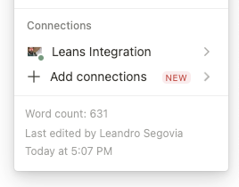
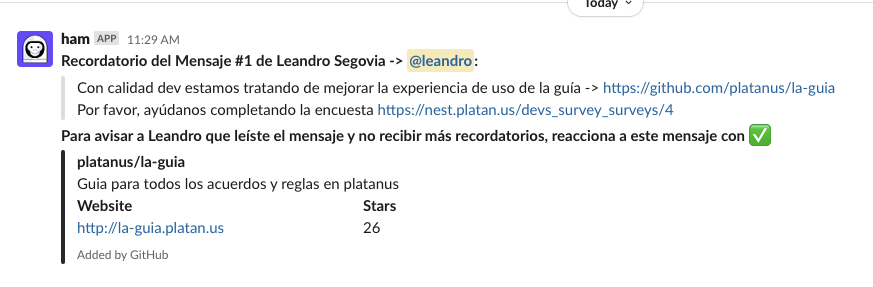

# Vue

# Vueeeeee
# Vue

hola vue
# Vue

## General
# Vue

[Vue.js](https://vuejs.org/v2/guide/) es un framework progresivo orientado a la construcción de [~~***`interfaces`***~~](http://google.com) de usuario, siendo capaz también de servir en la contrucción de SPAs.
# Vue

La documentación es excelente y [debería](http://google.com) ser el primer paso en caso de cualquier duda.
# Vue

Hay casos en que se pueden mezclar, como por ejemplo 👌 un componente complejo (un wizard o tour, por ejemplo) puede tener su propio estado **interno** dentro de una página de Rails, pero lo ideal es elegir uno de estos caminos por `proyecto` para evitar confusiones.
# Vue


# Vue

@Leandro Segovia probando la mention
# Vue

| que  | [https://www.google.com.ar/](https://www.google.com.ar/) |
| --- | --- |
| las 👿 | tablas |
| en | markdown |
# Vue

2022-09-30T09:00:00.000-03:00 
# Vue

2+2=4
# Vue

[Ver video](https://www.youtube.com/watch?v=1TewCPi92ro)
# Vue

```ruby
def bla
  puts("hello")
end
```
# Vue

```javascript
function bla() {
  console.info("bla");
}
```
# Vue


# Vue

### Holaaaa
# Vue

- [ ] Sí
# Vue

- [x] No
# Vue

> 💡 Lorem ipsum dolor sit amet, consectetur adipiscing elit. Nunc commodo molestie lorem non viverra. Vivamus in lectus arcu. Nam sit amet orci nisl. Aenean a massa aliquam eros pretium auctor a sed sapien. Curabitur quis nibh ultrices, scelerisque mi non, commodo orci. Ut malesuada, metus et consectetur euismod, nulla enim molestie ante, et pulvinar velit eros id augue. Etiam ornare, augue non egestas egestas, nisi nulla fermentum est, quis dignissim eros sapien id turpis. Maecenas eu urna eu diam facilisis auctor vitae eu lorem. Quisque quis vestibulum purus. In id magna purus. Fusce ex tellus, molestie efficitur posuere sed, posuere at odio. In at iaculis leo. Quisque at dolor ut felis vehicula viverra. Morbi mattis diam tortor, ac aliquam diam consequat ut.
# Vue

> Nulla posuere ex et lacus fringilla malesuada. Nullam vel urna at odio commodo convallis. Cras metus augue, eleifend ut efficitur in, mattis porta nunc.Donec mollis, libero eget ullamcorper porta, magna erat elementum quam, vel ullamcorper nibh leo vitae turpis. Aenean posuere nisl elit, quis euismod velit faucibus eget.
# Vue

---
# Vue

## Venatajas
# Vue

1. Bla

    1. ble

        | ddd | sdasd |
        | --- | --- |
        | asd | asd |
        | asd | asd |

    1. [tips vue](vue/tips_vue.md)

        1. [Super tips vue](vue/tips_vue/super_tips_vue.md)
# Vue

1. Blu

    1. aaarr

        ```ruby
        class Guides::NotionBlockParsers::Md::TextParserJob < Guides::NotionBlockParsers::Md::BaseParserJob
          ANNOTATIONS = [
            { name: "code", symbol: "`" },
            { name: "bold", symbol: "**" },
            { name: "italic", symbol: "*" },
            { name: "strikethrough", symbol: "~~" }
          ].freeze
        
          def parse
            formatted_text = text
        
            ANNOTATIONS.each do |annotation|
              if annotations[annotation[:name]]
                formatted_text = "#{annotation[:symbol]}#{formatted_text}#{annotation[:symbol]}"
              end
            end
        
            return formatted_text if url.blank?
        
            "[#{formatted_text}](#{url})"
          end
        
          private
        
          def annotations
            @annotations ||= block["annotations"] || {}
          end
        
          def url
            @url ||= block.dig("text", "link", "url")
          end
        
          def text
            @text ||= block["plain_text"]
          end
        end
        ```

    1. asdasda

        1. meeee

            

    
# Vue


# Vue

[Power API](power_api.md)
# Vue

[tips vue](vue/tips_vue.md)
# Vue


# Vue

* hola
# Vue

* soy
# Vue

* el
# Vue

* lean
# Vue


# Vue
# Vue
# Vue


# Vue


